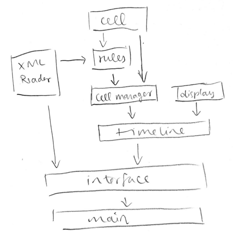
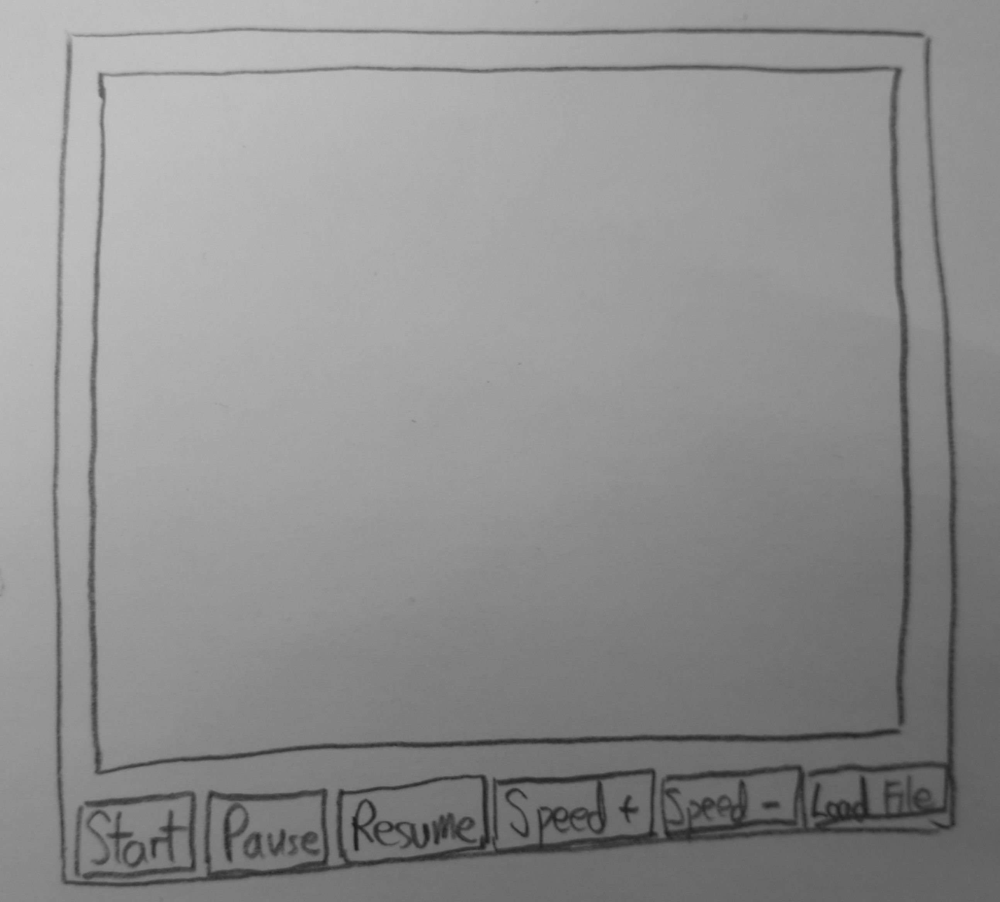

#Introduction

Cellular Automata, or CA, are grid based simulations that rely on interactions between any given number of cells, each one in a certain ‘state’ at any given point in the simulation.  Although simple in design, these grids can be used to represent a wide array of complex real world or hypothetical situations and interactions.  The program that our team will be writing is one that will be able to take in a number of user input arguments, including an XML file, that define the parameters for a certain CA simulation, and then proceed to run and display that simulation in a clean user interface.  The program must also be able to reset itself and change simulation ‘rules’ while running, also according to user input.  Aside from basic functionality, the most important aspect of this program will be its flexibility, or more specifically its ability to be adapted and modified in the future in order to satisfy potential changes in desired function.  The height of this flexibility will need to be in the program’s ability run different simulations, even on the same grid.  There are many different simulation rules that can be applied to a CA grid.  Our program must be able to run each of these and be easily modifiable if we wanted to add or remove any set of rules.  As such, we plan to keep many of our data structures and classes generalized whenever possible so that they are as adaptable as they can possibly be.  The primary architecture of our design will be based around keeping cell status and simulation information organized and easy to update.  Sets of simulation rules will be closed to each other but accessible by a single engine that will keep track of everything and manage the essential functionality of the program.  

#Overview

* Cell class: 

private int currstate

private int nextstate

private int X

private int Y

getState(): int method

setState(int): void

setnextState(int): void

getX():  int method

setX( int): void

getnY(): int method

setY(int): void

* (abstract) Rules class

Rule classes will inherit

abstract applyRule(Cell, List<List<Cell>>): void method

getPercent(int state, List<List<Cell>>): double method

* firstRule class (sub-class that extends Rule class)

* secondRule class (sub-class that extends Rule class)

* thirdRule class (sub-class that extends Rule class)
* CellManager class

Rules rules

List<List<Cell>> cellList

getCellList(): List<List<Cell>> method

setUp(): void method

updateStates(): void method

moveNextToCurrentState(): void method

* Display class

initDisplay(): void

updateDisplay(List<List<Cell>>): void method

GridPane grid

* Main

start(): void

main(args): void

* Interface class

handleInput(input): void

Buttons (Start, Pause, Resume, Speed+, Sped-)

init(Stage): void 

* Timeline/loop class

private double speed

checkConditions(): void method 

initSimulation(): void

starts Timeline class

stops, resets, etc

getSpeed(): double method

setSpeed(double): void method

step(): void method

* XML reader class

readInput(xml file): void method

handle errors(): void method

#User Interface

Overall, users will interact with the program for three main purposes. First, users will input the XML file and the program will take in the file for simulation to be run. This interaction would not need any components for the users and program; however, if the data is inappropriate, the users will be notified. Secondly, the users will be able to start and pause/resume the simulation, and lastly, they can make each simulation run faster or slower. For all three purposes, we will use buttons for each functions (start, pause/resume, and speed up/down). The primary erroneous situations would be when users put inappropriate data into the program. For instance, if the data is empty or it does not contain all the necessary information for its particular simulation, we will not run the simulation and let the user know that appropriate information must be taken in. Also, when users click Speed- button too much that it will stop or have negative speed, we will not handle inappropriate inputs and let the user know that you cannot make speed = 0. 

#Design Details 

* Cell class: 

This component is the object that is meant to represent a single cell in the simulation grid. For each simulation, a number of these Cell objects will be generated equal to the total number of cells on the grid, based on input information from the user or XML file.  Each cell must keep track of its own x and y location on the grid and its current state, represented by an integer.  This integer state will be interpreted and updated by methods in a Rules subclass, as explained later.  The Cell is defined very generally so that it can be applied to any number of different simulations, and is therefore adaptable enough to be extended for additional requirements.  All Cells will be kept organized within an ArrayList that is managed by the CellManager class, and can be accessed at specific times by whichever Rules subclass is active.

private int currstate - represents current state of cell at a given point in the simulation

private int nextstate - represents next state of cell at a given point in the simulation

private int X - represents x location of cell in the grid

private int Y - represents y location of cell in the grid

getState(): int method - returns current state of cell

setState(int): void - sets current state of cell

setnextState(int): void - sets next state of cell

getX():  int method - returns x location of cell

setX( int): void - sets x location of cell

getY(): int method - gets y location of cell

setY(int): void - sets y location of cell

* (abstract) Rules class:

This component defines the general structure and holds shared methods for implementing the rules of the simulation.  The Rules classes must be responsible for interpreting the state information of each cell and applying the predetermined set of rules to actually drive the simulation.  This abstract class is to be inherited by specific subclasses, one for each type of simulation that our program will be able to run.  It contains methods that should be commonly necessary, regardless of simulation type.  The rules classes will be accessed by the CellManager and by extension Timeline classes because the abstract applyRule method will need to be called at every frame of the main simulation loop.  It will have access, via CellManager’s ArrayList of cells, to all the active cells in a simulation as it will need to get, handle, and update state information for each of the cells.  We chose to use this inheritance hierarchy for applying the rules of each simulation beacuse it should allow our program to be as flexible as possible when applying a new set of rules.  In order to incorperate a whole new simulation, a single subclass is all that should need to be added to the program, without impacting other areas or causing a need for redundant code.
Rule classes will inherit

abstract applyRule(Cell, List<List<Cell>>): void method - this abstract method will be the most important for each subclass.  Based on specific simulation rules defined in the subclass, this method will interpret and update state information for every cell in the grid and essentially act as the major driver behind the simulation’s function.

getPercent(int state, List<List<Cell>>): double method - returns the percentage of cells in a grid in a certain state at a given instant in the simulation

Rules (subclass): One rules subclass will be made for every simulation type that the program will be able to run.  Each subclass will hold and implement information specific to the rules defined by its type of simulation.

* CellManager class

There are four specific features that cellManager class does. First, setup() method within the class will set up the grid of cells by creating Cell Objects and adding them into the list<list<list<Cell>> and initialize its state based on the XML input file. setUp() method will be called from Main / Cell society class and the class will pass an integer that tells which simulation we are running. Secondly, after a cycle of simulation, updateStates() method will be called from Timeline Class and the class will pass the integer that indicates which simulation the program is running to this method. What updateState() method does is to call applyRule method within Rule Class and pass the cellList and the integer that indicates which simulation. Third, moveNextToCurrentState() method is also called from Timeline Class. The method will access each Cell Object, put the nextState value into currentState value, and initializes the nextState value. Finally, getCellList() is a public getter method for the private List<List<Cell>> cellList so that other classes can access the CellList. 

* Display class:

This is the class that will display the grid with the cells. It will be accessed through the Timeline class, which will call updateDisplay at each step in order to carry out the simulation. The input for this method will be the cellList (which comes from CellManager and through Timeline). This class does not need to be extended, since all of its implementation, etc will be through Timeline. We created this class because we though it was necessary to have a component that would take care of the display but that was also separate from the timeline and the cellmanager. 

GridPane grid	-the actual object displayed

initDisplay(): void method- This will make a new gridpane. 

updateDisplay(List<List<Cell>>): void method - This will use the list of lists and go through 
each cell to get the state (current). Then, it will put these into a datat structure (probably another list of lists or an array) and pass these into the gridpane.

* Main Class:

For the Main Class, it will extend application for JavaFX use. We’ll launch in main void method and within start class, we will instantiate the interface class and call init method. We will pass the primaryStage to init method so that it can update the stage. Then, we will instantiate Timeline class and start the timeline. 

* Interface class:

This class will be the one that displays what needs to be displayed and handles user input. It will interact with the timeline class and with the XML reader class. It uses the input from clicking on the buttons, as well as the stage that is created in the main class. This could be extended in the future to add more features and to be more dynamic. 
handleInput(input): void- This will control timeline based on the user input.
Buttons (Start, Pause, Resume, Speed+, Sped-)
init(Stage): void- The Stage will be passed from the main class and then will be used to create the buttons, etc.

* Timeline class:

This class is the center of the project since it controls the way that things get updated. It will step through (if needed) and update every step, or go through with the animation indefinitely. Timeline uses CellManager and Display in order to update the states and then display them. This class can be extended by adding different ways to control the way the simulation runs.
private double speed- the rate at which the simulation updates

checkConditions(): void method- starts/stops, etc based on conditions given by interface.

initSimulation(): void -starts Timeline class and initializes whatever is needed

step(): void method- steps through (updates cellmanager and display, calling their update methods)

getSpeed(): double method- gets speed double

setSpeed(double): void method- sets speed double

* XML reader class:

This component will be responsible for most all of the ‘configuration’ section of the assignment specifications.  The class will read in the selected xml file, set necessary variable according to the specified paramters, and pass the information along to the timeline class, where it will be distributed as necessary.  For example, the simulation choice will be read in from the xml file.  This information will then be passed trough the Timeline class to the CellManager class so its updateStates() method will call on the correct Rules subclass.  The interface class will have acess to the XML reader so that the program can successfully read in any new file that may be chosen and loaded by the user.  All of the methods for reading and handling XML data will be limited to this class so any future updates we may need to make on our program can be made easily and in only one location.

readInput(xml file): void method - reads XML file and stores information

handle errors(): void method - handles errors within XML file

#Use Cases

* Apply the rules to a middle cell: set the next state of a cell to dead by counting its number of neighbors using the Game of Life rules for a cell in the middle (i.e., with all its neighbors)

Within the updateStates method in CellManager, the necessary instance of the Rules class will be called in order to use the applyRule method, which will have parameters cell (the middle one) and the entire list of lists of cells. This method will get the neighbors of the middle cell (based on their position in the list of lists). Then, it will get the states of these neighbor cells using getState() for each one and keep track of these (through a list). Finally, it will change the nextstate of the middle cell using setState().

* Apply the rules to an edge cell: set the next state of a cell to live by counting its number of neighbors using the Game of Life rules for a cell on the edge (i.e., with some of its neighbors missing)

Same as the previous; however, since the possible cell positions will be constrained ( from 0,0 to n,n), there will be less neighbor cells/states in the list.

* Move to the next generation: update all cells in a simulation from their current state to their next state and display the result graphically

To update the cells’ states, we use the method moveNextToCurrentState(). These will then be displayed using the updateDisplay method in the Display class, which takes the list of lists of cells and gets their states. These will be put into the integer array cellDisplay, which will then be used to change the appearance of the grid. Both methods will be called by the Timeline class.

* Set a simulation parameter: set the value of a parameter, probCatch, for a simulation, Fire, based on the value given in an XML fire

The readinput method in XMLReader will go through the XML file and set parameters as needed within the rules class.

* Switch simulations: use the GUI to change the current simulation from Game of Life to Wator

This will have to be done through the XML file. Once they click “load a new file”, the simulation will stop. Then, the new file will contain the necessary information to switch to Wator (which will initialize the Wator rules in cell manager.

#Design Considerations 

* Type of Data Structure to Keep Track of Cells:

Candidates: List<List<Cell>> vs. List<Cell>

List<Cell>: A positive aspect about using List<Cell> is that the iteration of each element is quite simple. However, in terms of 2-dimensional approach, the programmers have to calculate at which index of Cell is positioned. This might be difficult to find out the surrounding cells.

List<List<Cell>>: A negative aspect about using List<List<Cell>> is that the iteration of element might not be as simple as List<Cell>. However, it is much easier for programmers to keep track of the location for each cell. We can have the index number for the outer list as row and the one for the inner list as column. Thus, we decided to use List<List<Cell>> to keep track of individual Cells.

* Making a generalized abstract Rules class:

Discussion: We thought about having separate classes for each type of simulation when we began thinking about the project, because they seem really different from each other. However, we came to the agreement that an abstract class that would be inherited was necessary because it would lend the program the flexibility it needs.

PROS: can be used to extend in the future, can have shared methods, is easier to understand.

CONS: difficult to find shared properties, may not be worth it.

* Giving Cell Class currentState and nextState properties: 

Discussion: This design decision came about when we were discussing the functionality of our program.  Specifically, we needed to be able to solve the problem of updating the states of the entire grid simultaneously, rather than one at a time.  Originally, we had only one state property for each cell.  However, we would not have been able to update any cell without inadvertently inpacting the update conditions for the next one.  As a result, we came up with this design strategy so that each cell could have a future state as well as a current.

PROS: Solves design issue of cells being able to update simultaneously instead of in succession.

CONS: None that we can forsee at this point as it still allows the Cell to be generally defined and flexible.  However, we will continue to reasses the merits of this decision as our work progresses.

#Team Responsibilities

* Joe: Abstract Rules Class and implementation for 4 specific rules subclasses

* Huijia: Display, Interface, Timeline

* Jin: Main, Cell, cellManager

Even though each team member will have primary responsibility for certain aspects of implementation for this program, we will try to meet together as often as possible and help each other out in solving the more difficult challenges that writing this program may present.
